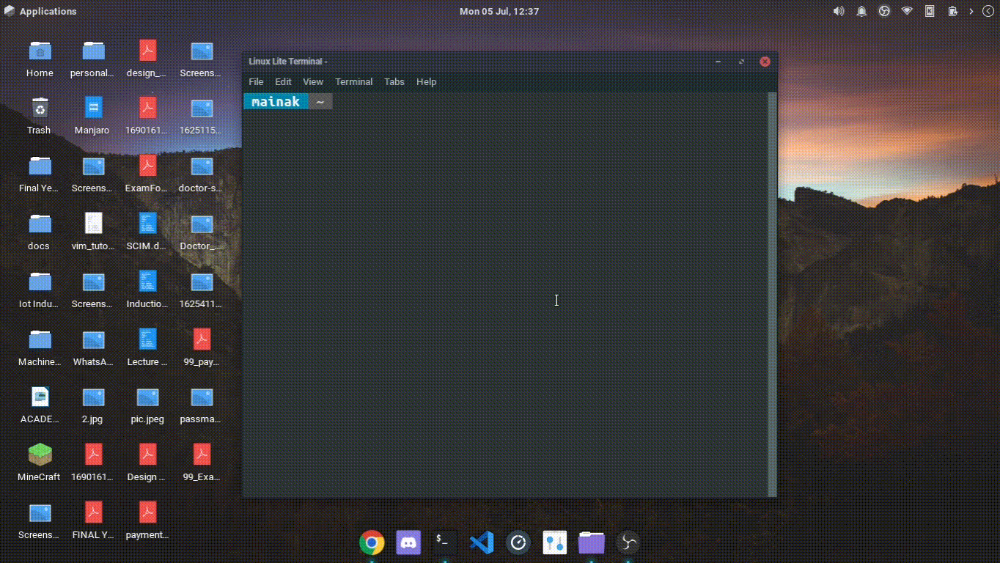
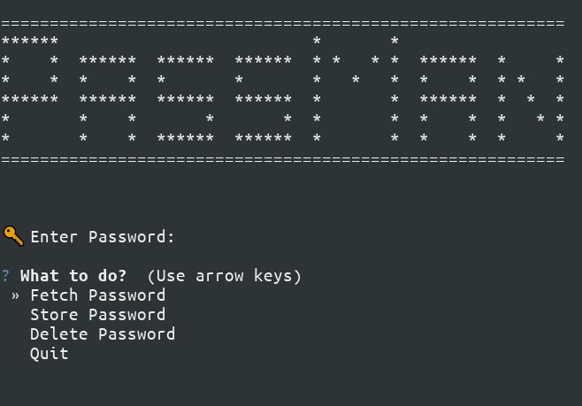
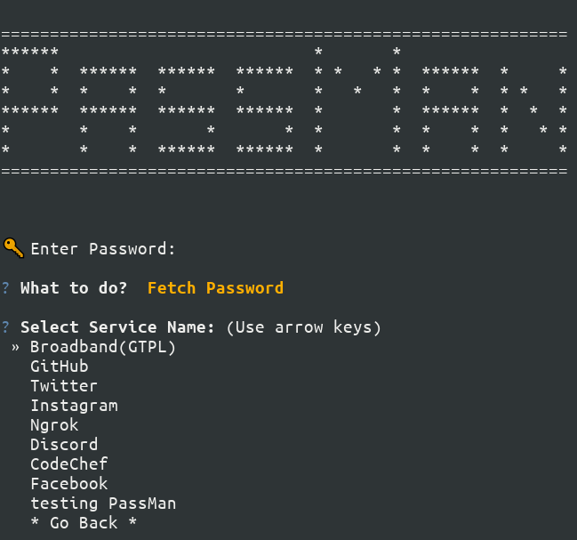
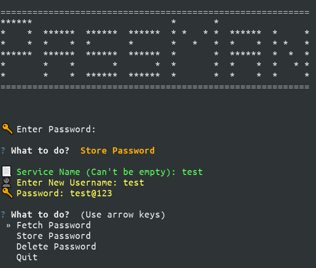

# PassMan

Simple CLI Password manager written in Python3


## Author

- [@mainak55512](https://github.com/mainak55512)

## Programming Language


## Demo



  
## Screenshots





  
## Run Locally

Clone the project

```bash
  git clone https://github.com/mainak55512/PassMan.git
```

Go to the project directory

```bash
  cd PassMan
```

Install dependencies

```bash
  pip3 install -r requirements.txt
```

Start the programme

```bash
  python3 PassMan.py
```
* *NOTE:*  To change the login password first run *"hashed_login_password_generator.py"*. This will generate a hashed password of your choice. Paste the password in *"Cred.json"*'s password field. Cred.json is stored in *.data* folder
